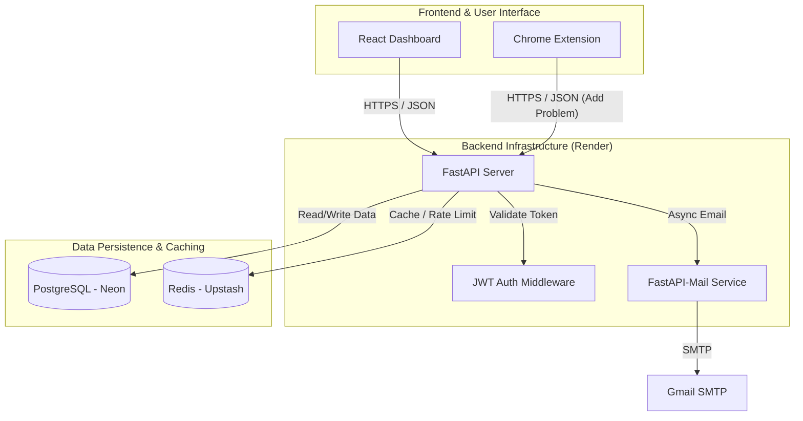

# Backtracker

Backtracker is a custom DSA‑sheet sharing and management platform built for competitive programmers to create, share, and collaborate on curated problem sets. It is meant mainly for saving problems of different platforms in a sheet and use it while revising. The frontend is a modern React app (built with Vite) and the backend is a high‑performance FastAPI service with SQLAlchemy ORM.

we had a custom chrome extension and also implemented Redis for caching and cache invalidation strategies that reduced database query load by 40%
for saving/sharing Problem URLs and details during grind.

Protected by JWT-based authentication and email-verified user on-boardings.Implemented Redis-based API rate
limiting to protect backend from abuse

**Live Demo**: https://backtracker1.onrender.com  

---

## Table of Contents

- [Features](#features)  
- [Screenshots](#screenshots)  
- [Tech Stack](#tech-stack)  
- [Architecture](#architecture)  
- [My Role](#my-role)  
- [Installation](#installation)  
  - [Prerequisites](#prerequisites)  
  - [Backend Setup](#backend-setup)  
  - [Frontend Setup](#frontend-setup)  
- [Usage](#usage)  
- [API Documentation](#api-documentation)  
- [Contributing](#contributing)  
- [Contact](#contact)  
- [Acknowledgements](#acknowledgements)  

---

## Features

- **User Authentication** via personal email : used FastAPI-Mail for verified user on-boardings.
- **Create & Manage Sheets**: group problems by topic, difficulty, status  
- **Share & Collaborate**: share read‑only/public links with peers , with options to add (+) desired to your sheet  
- **Filtering & Search**: find problems by tag, difficulty, or title
- **Custom Chrome Extension**: add our chrome extension and can easily add the problem to sheets, it auto fetches the name and url for ease.
- **Redis-based**: API Cache, Cache Invalidations and Rate limiting promises fast and reliable platfrom.
- **Responsive UI**: built with React and Vite for snappy client‑side performance and visualized meteric using bar graphs
- **Robust API**: FastAPI backend with SQLAlchemy models, Pydantic validation, and automated docs  

---
# Landing Page


## Tech Stack

- **Backend**  
  - Python 3.10, FastAPI  
  - SQLAlchemy ORM, PostgreDB (Neon DB)
  - Redis (Uptash)  
  - Uvicorn ASGI server  
  - Pydantic for data validation  
- **Frontend**  
  - React 18+, Vite  
  - React Router, Axios  
  - CSS Modules  
- **Dev & Deployment**  
  - Deployed on Render with seeded data
  - Currently AWS Architecture designing is going on!

---

## Architecture


## My Role

- **Backend Development**  
  - Designed and implemented the RESTful API with FastAPI  
  - Defined SQLAlchemy models, migrations, and relational schemas
  - Implement Redis-based optimisations
  - Secured endpoints with JWT‑based authentication tied to college email domain  
  - Wrote Pydantic schemas for request/response validation
  - Integrated API endpoints with frontend components via Axios 
      
- **Collaboration**  
  - Worked alongside a Gemini 3 PRO who helped in building out the React/Vite frontend 

---

## Installation

### Prerequisites
- no much version specific installations
- Python 3.11+  
- Node.js 16+ & npm or Yarn  
- PostgreSQL 12+ (or any SQL‑compatible DB)  

### Backend Setup

```bash
# 1. Clone this repo
git clone https://github.com/kowshikdontu/Backtracker.git
cd Backtracker/app

# 2. Create & activate a virtual environment
python3 -m venv venv
source venv/bin/activate

# 3. Install Python dependencies
pip install --upgrade pip
pip install -r ../requirements.txt

# 4. Configure environment variables
cp .env.example .env
# Edit DATABASE_URL, SECRET_KEY, etc. in .env

# 5. Run database migrations (if using Alembic)
# alembic upgrade head

# 6. Start the server
uvicorn main:app --reload --host 0.0.0.0 --port 8000
```

### Frontend Setup

```bash
# In a new terminal:
cd Backtracker/frontend
npm install
npm run dev
```

### Enviromental Variables 
- DATABASE_URL 
- REDIS_URL 
- BACKEND_URL  = "http://127.0.0.1:8000" ( give original one when deployed as email templates use them )
- FRONTEND_URL = "http://localhost:3000"
- SECRET_KEY 
- ALGORITHM 
- ACCESS_TOKEN_EXPIRE_MINUTES
- MAIL_USERNAME (your mail as admin )
- MAIL_PASSWORD ( get that from app passwords of yout adi
- MAIL_PORT = 587
- MAIL_SERVER  = "smtp.gmail.com"


---

## Usage

1. Register or log in with your email.  
2. DSA Corner has a dedicated sheet, where you can save your problem links with desired tags.  
3. Add or import problems (LeetCode IDs, custom entries).  
4. Share your sheet via access code.  
5. Exam Corner under construction for easy paper sharing during semester exams
6. For Extension follow installation guide in website
    -  Installation Guide
          * Go to our GitHub Repository (button below).
          * Download the extension ZIP and extract/unzip it.
          * Open Chrome and go to chrome://extensions
          * Toggle Developer mode (top right corner).
          * Click Load unpacked and select the backtracker_extension folder inside the unzipped files.
          * Enable it and Log in with our website Credentials and can use it in any Platforms as shown.
---

## API Documentation

FastAPI provides interactive docs:


- **Swagger UI**: `http://localhost:8000/docs`  
- **Redoc**:       `http://localhost:8000/redoc`  

---


## Contributing

1. Fork the repo  
2. Create a feature branch (`git checkout -b feature/foo`)  
3. Commit your changes (`git commit -am "Add foo"`)  
4. Push to the branch (`git push origin feature/foo`)  
5. Open a Pull Request for review  

Please follow the existing code style and write tests where applicable.

---

## Contact

Developed by **Dontu Kowshik**  
- GitHub: [@kowshikdontu](https://github.com/kowshikdontu)  
- Email: kowshikdontu@gmail.com

---

## Acknowledgements

- Thanks to my Gemini for helping me in developing Frontend.
- Inspired by the full‑stack FastAPI + React templates  
